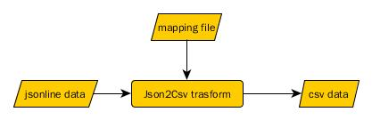

# json2csv
## 概要
- 来源
 json2csv是源自投哪网大数据部门的一个数据处理工具。
- 场景
 来源与不同的第三方公司的数据汇聚一起成为公司的重要资产，这些数据各式各样，以json的格式存储在hdfs中。半结构化的json数据并不利于风控分析人员来使用，为此催生了将json转换，并存储到hive的需求。在hive中，每一个表数据都是以csv格式存在（单元格用\001区分）。
- 面临的挑战
  1. 市面上并没有较为完整的json2csv方案。传统的json2csv方案为自动推倒出模型结构，在遇到json数组的情况时，并没有做很好的处理。
  2. json2csv不仅是技术人员使用，数据分析人员也要了解数据的来龙去脉。
  3. 面对大量的不同来源，不同模型的数据，需要快速解析出不同的表数据。
- 目标
   json2csv致力于构建一个快速，高效，开放，完整的数据解析工具

## 入门
```text
# 图形表达

json - mapping - > csv

# 案例
案例1： Json2CsvApp
案例2： Json2CsvMappingAdaptor api使用
```


### 案例1：Json2CsvApp
```java
import org.junit.Test;
import java.io.IOException;

public class AppTest {
   
    @Test
    public void shouldAnswerWithTrue() throws IOException {
        Json2CsvApp app = new Json2CsvApp();
        String dataDir = System.getProperty("user.dir") + "/src/test/resources";
        String mappingFile = dataDir + "/mapping/TweeterUserMapping.md";
        String jsonFile = dataDir + "/json/tweeter-user.jl";
        String csvDir = dataDir + "/csv";
        app.json2csv(mappingFile, jsonFile,csvDir);
    }
}
```

### 案例2：Json2CsvMappingAdaptor api使用
```java

package cn.touna.json2csv.resolve;

import cn.touna.json2csv.Json2CsvMappingMarkdownLoader;
import cn.touna.json2csv.model.Json2CsvMapping;
import cn.touna.json2csv.model.ResolveResult;
import com.alibaba.fastjson.JSONObject;
import org.junit.Test;

import java.io.IOException;
import java.text.SimpleDateFormat;
import java.util.Date;
import java.util.List;
import java.util.Map;

import static org.junit.Assert.*;

public class Json2CsvMappingAdaptorTest {

    @Test
    public void resolve() throws IOException {
        //解析配置
        ResolverConfig resolverConfig = new ResolverConfig();
        resolverConfig.setNullResolver(new NullResolver() {
            @Override
            public boolean isNull(String value) {
                if(value == null || value.length() == 0 || "{}".equals(value) || "[]".equals(value))
                    return true;
                return false;
            }
        });
        resolverConfig.setNullString("\\N");
        resolverConfig.setTypeConverter(new TypeConverter() {

            private SimpleDateFormat sdf = new SimpleDateFormat("yyyy-MM-dd HH:mm:ss");
            @Override
            public String convert(String type, String value) {
                if("timestamp".equals(type)){
                    if(value.matches("\\d+"))
                        return value;
                    try{
                        Date date = sdf.parse(value);
                        return String.valueOf(date.getTime());
                    }catch (Exception e){
                        e.printStackTrace();
                    }
                }
                return null;
            }
        });
        resolverConfig.setCellSeparator("\001");

        //解析器
        Json2CsvResolver resolver = new Json2CsvResolver(resolverConfig);

        //映射文件加载器
        Json2CsvMappingMarkdownLoader loader= new Json2CsvMappingMarkdownLoader();
        String mappingPath = "file://yourdir/mapping.md";
        List<Json2CsvMapping> mappingList = loader.loadFromFile(mappingPath);

        JsonDataResolver jsonDataResolver = new Json2CsvMappingAdaptor(resolver,mappingList);

        String jsonStr = "...";
        JSONObject jo = JSONObject.parseObject(jsonStr);

        ResolveResult resolveResult = jsonDataResolver.resolve(jo);
        Map<String, List<String>> resolvedData = resolveResult.getResolvedData();
        for (Map.Entry<String, List<String>> entry : resolvedData.entrySet()) {
            System.out.println("Table: " + entry.getKey());
            System.out.println("---------------------------------");
            for (String line : entry.getValue()) {
                System.out.println(line);
            }
            System.out.println();
        }
    }
}

```

## 映射文件
```text
1. 为什么要选择markdown 
2. 文件的元素
- document title
- table title 
- config
- fields
3. jsonpath
```

## json转换函数
```text
1. 内置转换函数
2. 逐一介绍函数
3. 拓展
```

## api

## 更多定制化
```text
1. markdown包含更多的配置
2. 

```
